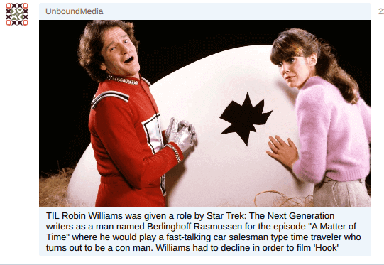

## :grey_question: How it works

This solution is useful for you if you want to create a channel in Utopia, but do not want to manually fill it with content. This bot will do everything for you.

You choose the subreddit and the channel in Utopia to transfer these posts to. Further along the crown, call this bot to transfer 1 post from the last posts in 24 hours.
The bot processes only those posts to which a link or image is attached.

The finished build can be found on the [releases page.](releases)

Example post:



## :page_with_curl: Features

1. The bot can work with multiple Utopia-channels & subreddits.
2. You can set the exact time of posts or the frequency.
3. Very easy to run - the application works through the docker.

## :zap: Get started

1. Simply change the parameters in `docker-compose.yml` file (NOTE: do not change `UTOPIA_` params).
2. Put `account.db` Utopia account file in app directory.
3. Run:

```bash
docker-compose up -d
```

:information_source: view bot logs:

```bash
docker container logs reddit2utopia_bot_1
```

:information_source: view Utopia client logs:

```bash
docker container logs reddit2utopia_utopia-api_1
```

:information_source: If there is no container by this name, then you can find it through:

```bash
docker ps -a | grep reddit2utopia
```

:information_source: stop app:

```bash
docker-compose down
```

## :checkered_flag: Useful links

1. [What is Utopia?](https://udocs.gitbook.io/utopia-api/)
2. [Utopia coins: CRP, UUSD](https://udocs.gitbook.io/utopia-api/what-is-utopia/project-coins)
3. [Utopia API](https://udocs.gitbook.io/utopia-api/utopia-api)
4. [API examples](https://udocs.gitbook.io/utopia-api/utopia-api/examples-of-projects)
5. [Crypton Exchange API Libs](https://udocs.gitbook.io/utopia-api/crp.is-api)
6. [Crypton Exchange API Examples](https://udocs.gitbook.io/utopia-api/crp.is-api/example-of-projects)
7. [Developer Thread](https://talk.u.is/viewforum.php?id=8)
8. [Utopia Official Website](https://u.is/)
