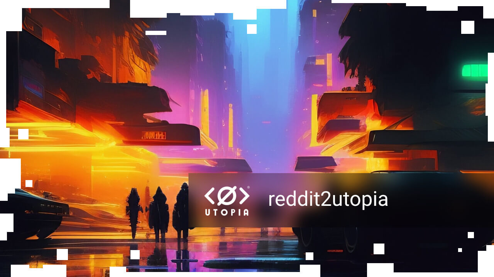

## concept

This solution is useful for you if you want to create a channel in Utopia, but do not want to manually fill it with content. This bot will do everything for you.

You choose the subreddit and the channel in Utopia to transfer these posts to. Further along the crown, call this bot to transfer 1 post from the last posts in 24 hours.
The bot processes only those posts to which a link or image is attached.

The finished build can be found on the [releases page.](releases)

## run in docker

```bash
docker-compose up
```

## setup

```
TODO
```

## useful links

```
TODO
```
